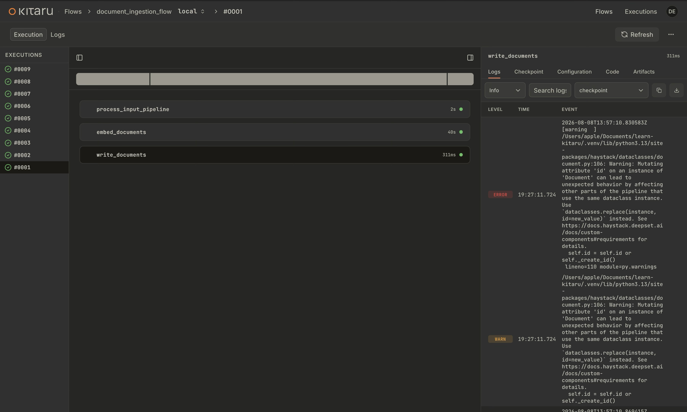
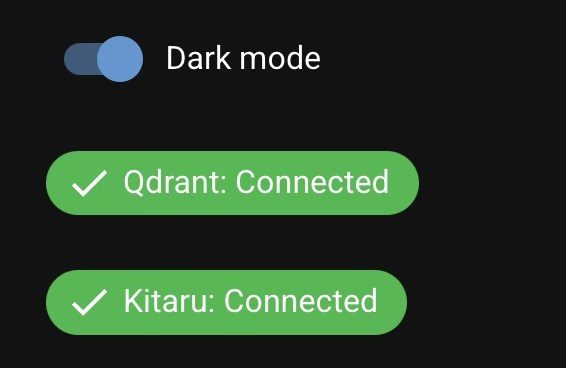

# Play ▶️, Pause ⏸️, and Replay 🔁 AI agents

A minimal [Haystack](https://haystack.deepset.ai) + [Kitaru](https://www.zenml.io/product/kitaru) demo through document ingestion, retrieval, and generation.


## Setup

1. Install [uv](https://docs.astral.sh/uv/getting-started/installation/).
2. Create virtual environment and install the dependencies: `uv sync`.
3. Activate virtual environment: `source .venv/bin/activate`
4. Set the [Cohere API key](https://dashboard.cohere.com) inside `.env`.
5. Start Qdrant instance locally through docker.
```bash
docker run -p 6333:6333 qdrant/qdrant:latest
```
6. Start the kitaru server locally.
```bash
kitaru login
```

## Run Frontend

```bash
uv run python -m src.app.main
```

Then open the NiceGUI app in your browse (http://127.0.0.1:8080), upload a CSV and ask a question.

> [!NOTE]
> You can use the app only if Qdrant and Kitaru services are `UP` and healthy.
> 
